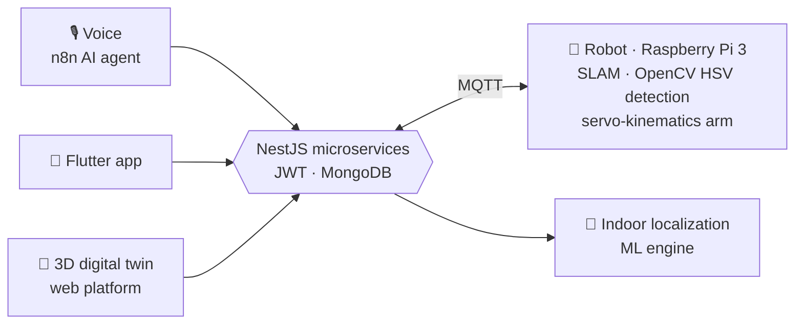

<div align="center">

# Mohamed Fouad Rabahi

**I connect things: networks, sensors, robots, and models.**
<br>
Final-year Systems & Networks engineering student · ESI-SBA, Algeria 🇩🇿 · Exchange alumnus, University of Montevallo 🇺🇸

<br>

`Arabic` · `English` · `Français`

</div>

<br>

```text
$ traceroute --story fouad

 hop  where                                     what happened
 ───  ────────────────────────────────────────  ──────────────────────────────────────────────
  1   Lycée Technique, Algeria · 2021           Technical Maths bac, 18.27/20, top of class
  2   Algerian Youth Leadership Program · 2020  First time building things across borders
  3   ESI-SBA · 2021 → now                      Engineering degree: AI, systems, networks, OS
  4   GDSC ESI-SBA · 2023–24                    Vice President: 4 events, 200+ people, +15% members
  5   Univ. of Montevallo, USA · 2024           UGRAD exchange, GPA 3.75, Dean's List, IT helpdesk
  6   Algérie Télécom / SONATRACH · 2025        FTTH, MSAN, VLANs, OTDR, firewalls, network migration
  7   GTC · 2025                                60h ML track: fraud detector on 1.8M+ records
  8   Smart-Assistive-Home-System · 2026        Lead dev & architect: home + robot + digital twin
  9   → you are here                            open to internships, engineering roles, and projects

 trace complete. destination reachable. latency to a good conversation: low.
```

<br>

## 🏠 Featured project: Smart-Assistive-Home-System

A smart home that **talks, sees without cameras, and fetches things for you**. I led the design and architecture of a four-person capstone that joins a home-automation platform with an assistive robot.



- **Camera-free surveillance** and **indoor localization** driven by an ML engine
- **Autonomous robot**: SLAM navigation, HSV object detection, full item-retrieval pipeline with a custom robotic arm
- **Backend**: microservices over MQTT, JWT auth; **mobile app** in Flutter; **3D digital twin** for real-time monitoring

<sub>Stack: NestJS · MongoDB · MQTT · Flutter · Raspberry Pi · OpenCV · Python · n8n</sub>

<br>

<details>
<summary><b>🛡 Credit Card Fraud Detection</b> · XGBoost · 96.2% accuracy · 1.8M+ records</summary>
<br>

Built during a 60-hour certified ML track at the Generative Technology Center: data wrangling, EDA, model training, then deployment as a **Streamlit** app on real-world data.

</details>

<details>
<summary><b>🎓 HeurSup</b> · full-stack professor management platform</summary>
<br>

React + Express.js + Prisma. Role-based dashboards and automated overtime calculations on the backend.

</details>

<details>
<summary><b>🦾 Raspberry Pi robotic arm controller</b> · Flask + pigpio</summary>
<br>

Browser-based control of shoulder, elbow, and gripper servos from a Raspberry Pi.

</details>

<br>

## 🧰 Stack, by OSI layer

I started in the cables and worked my way up, which is why I like systems that span the whole stack.

| Layer | What I work with |
|:--|:--|
| **L1–L2 · Physical & link** | Fiber (FTTH, OTDR diagnostics), copper-to-fiber migration, VLANs |
| **L3–L4 · Network & transport** | IPv4/IPv6, NAT/PAT, RIP · OSPF · EIGRP, VPN, QoS/QoE · Cisco Packet Tracer, GNS3, Wireshark |
| **L5–L6 · Session & data** | MQTT, REST, JWT · PostgreSQL, MongoDB, Cassandra, Oracle |
| **L7 · Application** | Python, Java, C, SQL, JavaScript · React, NestJS, Express, Prisma, Flutter, Docker, Linux |
| **L8 · The humans** | Leadership, public speaking, video production (Premiere, After Effects), Figma |
| **Beyond the stack** | Pandas, NumPy, XGBoost, Streamlit, Power BI, OpenCV |

<br>

## 🏅 Field notes

- 🤖 **Finalist**, First Global Robotics Competition, Switzerland (2022)
- 🥉 **Bronze**, Grand Challenge Award, Team Algeria (2020)
- 🥈 **Silver**, National Mathematics Olympiad (2021)
- 🎬 Video lead at Alphabit Club, so my demos come with decent editing

<br>

<div align="center">

### Let's connect something

[](https://www.linkedin.com/in/mohamed-fouad-rabahi-3b211a1b5/)
[](mailto:Mouhamed.fouad44@gmail.com)

<sub>`ping fouad` → reply guaranteed 📡</sub>

</div>
