<div align="center">
  
</div>

<p align="center">
  
  
  
</p>

<p align="center"><i>I connect things: networks, sensors, robots, and models.<br>
Final-year engineering student in Algeria 🇩🇿, with a semester of US campus life 🇺🇸 behind me.</i></p>

<br>


```text
$ traceroute --story fouad

 hop  where                                     what happened
 ───  ────────────────────────────────────────  ──────────────────────────────────────────────
  1   Lycée Technique, Algeria · 2021           Technical Maths bac, 18.27/20, top of class
  2   Algerian Youth Leadership Program · 2020  First time building things across borders
  3   ESI-SBA · 2021 → now                      Engineering degree: AI, systems, networks, OS
  4   GDSC ESI-SBA · 2023–24                    Vice President: 4 events, 200+ people, +15% members
  5   Univ. of Montevallo, USA · 2024           UGRAD exchange, GPA 3.75, Dean's List, IT helpdesk
  6   Algérie Télécom / SONATRACH · 2025        FTTH, MSAN, VLANs, OTDR, firewalls, network migration
  7   GTC · 2025                                60h ML track: fraud detector on 1.8M+ records
  8   Smart-Assistive-Home-System · 2026        Lead dev & architect: home + robot + digital twin
  9   → you are here                            open to internships, engineering roles, and projects

 trace complete. destination reachable.
```

<br>

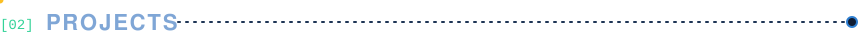

<a href="https://github.com/fouad3966/Smart-Assistive-Home-System"></a>

<details>
<summary><b>How the capstone fits together</b> (architecture)</summary>
<br>

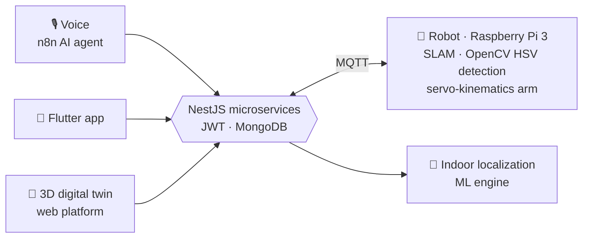

</details>

<table>
<tr>
<td width="50%" align="center">
  <a href="https://github.com/fouad3966/HeurSup"></a><br>
  <a href="https://heur-sup.vercel.app/"></a>
</td>
<td width="50%" align="center">
  <a href="https://github.com/fouad3966/apex-athletics">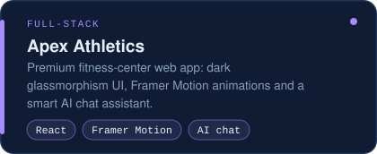</a><br>
  <a href="https://fouad3966.github.io/apex-athletics"></a>
</td>
</tr>
<tr>
<td align="center">
  <a href="https://github.com/fouad3966/Ecom_Luxecart"></a><br>
  <a href="https://ecom-luxecart.vercel.app/"></a>
</td>
<td align="center">
  <a href="https://github.com/fouad3966/5G-SliceGuard">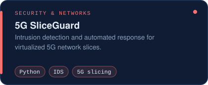</a><br>
  <a href="https://fouad3966.github.io/5G-SliceGuard/"></a>
</td>
</tr>
<tr>
<td align="center">
  <a href="https://175-viral-templates-mx3y.vercel.app/"></a><br>
  <a href="https://175-viral-templates-mx3y.vercel.app/"></a>
</td>
<td align="center">
  <a href="https://digitmake.net/"></a><br>
  <a href="https://digitmake.net/"></a>
</td>
</tr>
<tr>
<td align="center">
  <a href="https://github.com/fouad3966/Bearing_Simulation_PFE">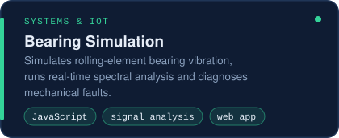</a><br>
  <a href="https://bearing-simulation-pfe.onrender.com/"></a>
</td>
<td align="center">
  <a href="https://github.com/fouad3966/ML-pipeline-to-detect-fraudulent-credit-card-transactions"></a><br>
  <a href="https://credit-card-fraud-detect-9vsoerj.gamma.site/"></a>
</td>
</tr>
<tr>
<td align="center">
  <a href="https://github.com/fouad3966/Intelligent_Agent_for_Natural_Language_Database_Querying"></a><br>
  <a href="https://intelligent-agent-for-natural-langu.vercel.app/"></a>
</td>
<td align="center">
  <a href="https://github.com/fouad3966/project-multimedia---QR-codes"></a><br>
  <a href="https://fouad3966.github.io/project-multimedia---QR-codes/"></a>
</td>
</tr>
</table>

<details>
<summary><b>More experiments</b> · data analytics, ML notebooks, networking labs</summary>
<br>

- [`TCP-Client-Server`](https://github.com/fouad3966/TCP-Client-Server): Python sockets with a Gradio interface
- [`diabetes-ml-prediction`](https://github.com/fouad3966/diabetes-ml-prediction): Logistic Regression, Random Forest, SVM with GridSearchCV
- [`Housing-Price-Prediction`](https://github.com/fouad3966/Housing-Price-Prediction): tuned Random Forest
- [`gtc-ml-project1-hotel-bookings`](https://github.com/fouad3966/gtc-ml-project1-hotel-bookings): cleaning, feature engineering, preprocessing pipeline
- [`DA-Churn-Prediction-for-StreamWorks-Media`](https://github.com/fouad3966/DA-Churn-Prediction-for-StreamWorks-Media) · [`DA-Business-Intelligence-Dashboard-for-TechHub-Retail`](https://github.com/fouad3966/DA-Business-Intelligence-Dashboard-for-TechHub-Retail) · [`DA-green-cart-sales-customer-insights`](https://github.com/fouad3966/DA-green-cart-sales-customer-insights) · [`DA-customer-signup-analysis`](https://github.com/fouad3966/DA-customer-signup-analysis)
- [`IoT-Network-Anomaly-Detection`](https://github.com/fouad3966/IoT-Network-Anomaly-Detection): ML models for detecting anomalies in IoT networks
- [`2CS_S2_Modules_Revision`](https://github.com/fouad3966/2CS_S2_Modules_Revision): revision guides for fellow students

</details>

<br>

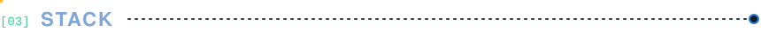

<table>
<tr>
<td width="170"><b>Languages</b></td>
<td></td>
</tr>
<tr>
<td><b>Web & backend</b></td>
<td></td>
</tr>
<tr>
<td><b>Databases</b></td>
<td></td>
</tr>
<tr>
<td><b>AI & data science</b></td>
<td><br><sub><code>XGBoost</code> <code>Big Data</code> <code>Streamlit</code> <code>Matplotlib</code> <code>Google Colab</code> <code>feature engineering</code></sub></td>
</tr>
<tr>
<td><b>Tools & OS</b></td>
<td></td>
</tr>
<tr>
<td><b>Networking</b></td>
<td><code>OSPF</code> <code>EIGRP</code> <code>RIP</code> <code>VLAN</code> <code>NAT/PAT</code> <code>IPv4/IPv6</code> <code>VPN</code> <code>QoS/QoE</code> <code>MQTT</code> <code>REST</code><br><code>Cisco Packet Tracer</code> <code>GNS3</code> <code>Wireshark</code> <code>FTTH</code> <code>MSAN</code> <code>OTDR</code></td>
</tr>
<tr>
<td><b>Design & media</b></td>
<td></td>
</tr>
<tr>
<td><b>People skills</b></td>
<td>Leadership · public speaking · event organization · cross-cultural teamwork</td>
</tr>
</table>

<br>


- 🤖 **Finalist**, First Global Robotics Competition, Switzerland (2022)
- 🥉 **Bronze**, Grand Challenge Award, Team Algeria (2020)
- 🥈 **Silver**, National Mathematics Olympiad (2021)
- 🎤 **VP, Google Developers Student Club ESI-SBA**: 4 events, 200+ participants, membership up ~15%
- 🎬 **Video lead, Alphabit Club**: so my demos come with decent editing
- 🌍 **Global programs**: UGRAD, Algerian Youth Leadership Program, The Experiment Digital, Tatawwar, Dialogue Leaders

<br>

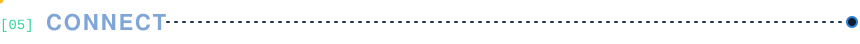

<p align="center">
  <a href="https://www.linkedin.com/in/mohamed-fouad-rabahi-3b211a1b5/"></a>
  <a href="mailto:Mouhamed.fouad44@gmail.com"></a>
</p>

<p align="center"><sub><code>$ ping fouad</code> → 64 bytes, reply guaranteed 📡</sub></p>
